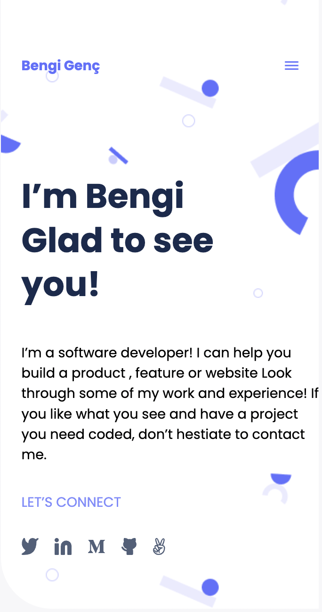
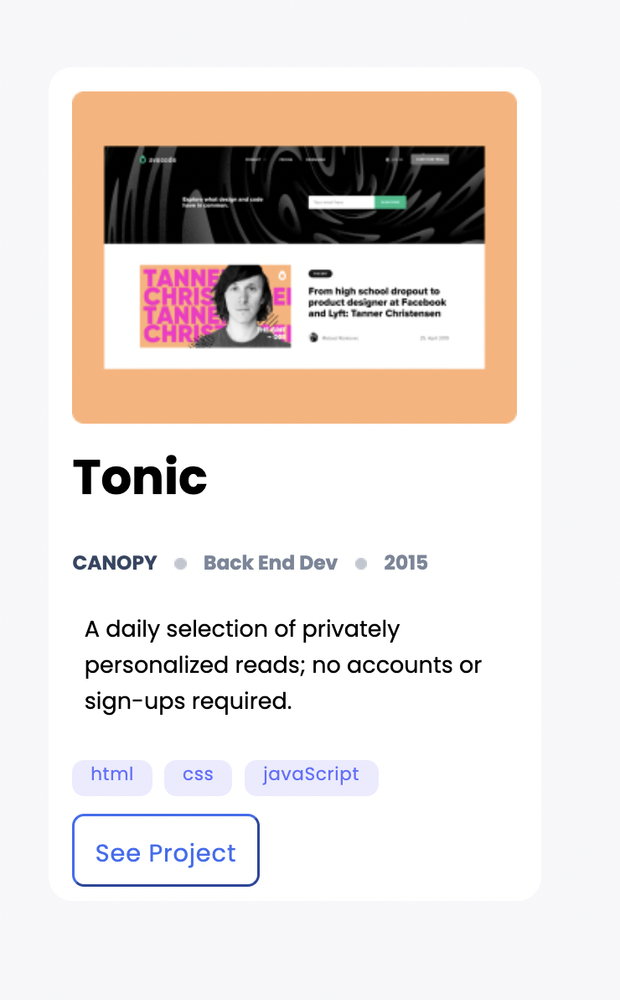
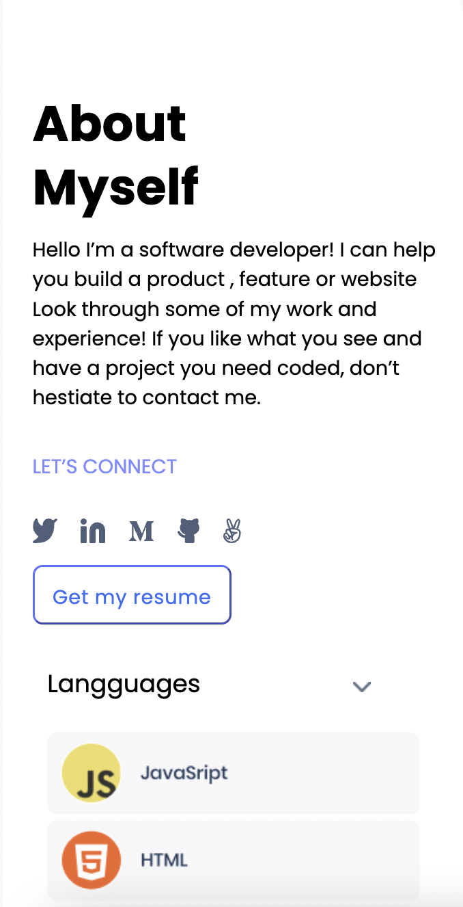

# Micronaut Portfolio

> This project is created as part of the Microverse curriculum practice. The purpuse of the project is to practice
- using HTML&CSS Linters
- parsing a Figma design
- understanding flex and grid displays
- using images, media and backgrounds
- creating a personal portfolio
- while presenting a professional repository

## Built With

- HTML
- CSS

## Screenshot

[Live Demo Link](preview.png)

## Getting Started

To get a local copy up and running follow these simple example steps.

- go to the directory that you want to clone the repository in.

- right click and choose Git Bash here.

- type "git clone git clone https://github.com/bengigo/micronaut-portfolio".

- Go to the dist folder and open `index.html`

## 👤 **Author**

- GitHub: [@githubhandle](https://github.com/bengigo)
- Twitter: [@twitterhandle](https://twitter.com/bengi_gb)
- LinkedIn: [LinkedIn](https://www.linkedin.com/in/bengi-g-03b883199/)

## 🤝 Contributing

Contributions, issues, and feature requests are welcome!

Feel free to check the [issues page](../../issues/).

## Show your support

Give a ⭐️ if you like this project!

## 📝 License

This project is [MIT](./MIT.md) licensed.
